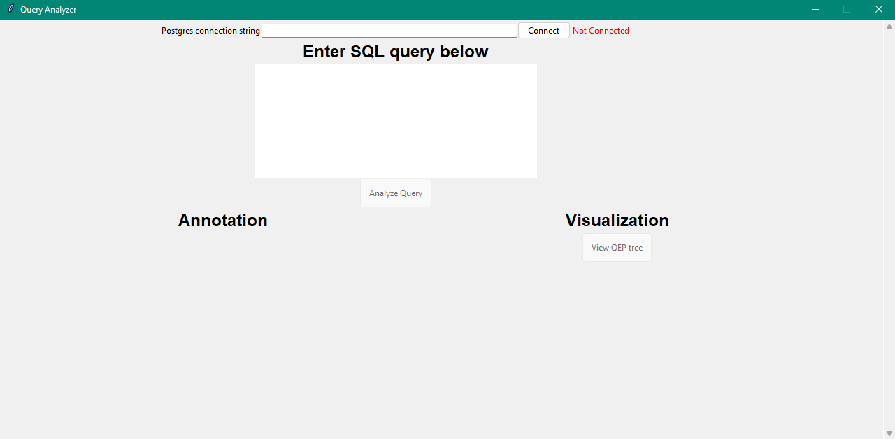
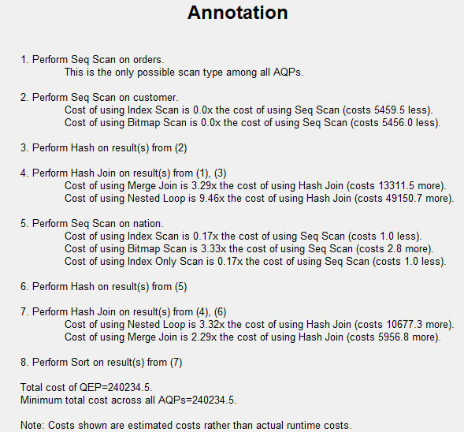

# CZ4031 - Project 2



## Requirements

- Python >= 3.11.0
- PostgresSQL >= 15
- Database set up in PostgresSQL
- Graphviz == 7.0.1

## Graphviz Setup

Downloading Graphviz is necessary in order to view graphical representation of Query Plan Tree.
1. Download [Graphviz](https://graphviz.org/download/)
2. Unzip folder (can use [7ZIP](https://www.7-zip.org/download.html) to unzip folder)
3. Move unzipped folder to `C:/Program Files (x86)`

**NOTE**: In order for Graphviz to work, the user must configure the `PATH` environment variable. After configuring the `PATH` environment variable, a **restart** of the computer will be needed for the change to take effect

- For user variable, add to environment variable `Path` the following: `C:\Program Files (x86)\Graphviz\bin`
- For system variable, add to environment variable `Path` the following: `C:\Program Files (x86)\Graphviz\bin\dot.exe`
- To test if change has been made, open up terminal and run
```bash
dot
```

## Steps

1. Change directory to folder

```bash
cd project2
```

2. Install Dependencies

```bash
pip install -r requirements.txt
# OR
pip3 install -r requirements.txt
```

3. Run project

```bash
python ./project.py
# OR
python3 ./project.py
```

4. Establish connection with database

Enter the database connection string into the `Postgres connection string` input.

[Read docs](https://www.postgresql.org/docs/current/libpq-connect.html#LIBPQ-CONNSTRING)

Example:

```bash
postgresql://<USERNAME>:<PASSWORD>@<HOST>:<PORT>/<DATABASE NAME>
```

5. Analyze query

Enter query into the textbox, and the results will be displayed upon clicking the `Analyze Query` button

## Sample Test

The following sample test uses the `TPC-H` database as a source of data.

1. Enter Query

```postgres
SELECT customer.c_custkey
FROM (SELECT * FROM customer WHERE customer.c_custkey > 1) AS customer, nation, orders
WHERE customer.c_nationkey = nation.n_nationkey AND customer.c_custkey = orders.o_custkey
ORDER BY customer.c_nationkey, nation.n_nationkey;
```

2. Click `Analyze Query`
3. Annotation Results Display


</img>

### Additional Information

- [PostgresSQL Optimizer](https://www.postgresql.org/docs/current/planner-optimizer.html)
- [Scan Methods](https://severalnines.com/blog/overview-various-scan-methods-postgresql/)
